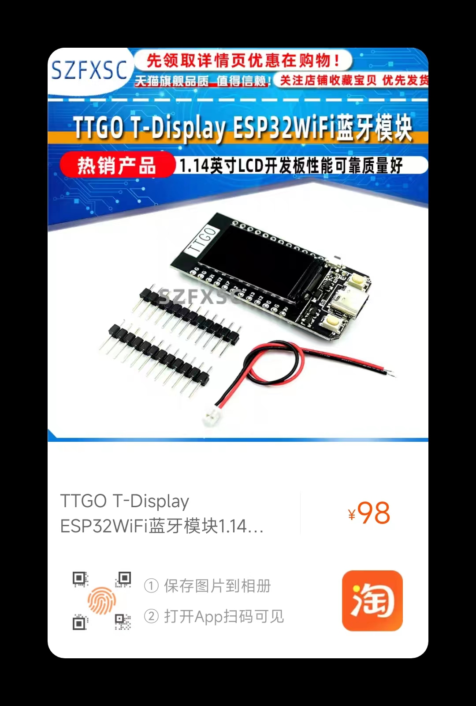

# Xiaoqian-Xu
Design of intelligent classroom fire monitoring system based on Internet of Things

## 目录

1. 仓库介绍 Introduction
2. 方案设计 Scheme Design
3. 硬件选型 Hardware Selection
4. 

## Introduction

## Scheme Design

采用`esp32`为主控，通过人体热释电感应传感器检测教室是否有人，通过火焰传感器检测是否存在火源、通过烟雾传感器检测是否存在烟雾，通过温度传感器检测当前教室温度，通过`oled`显示当前教室信息。

当出现火灾时，`esp32`通过无线的方式将通知信息通过消息通知服务发送到手机，同时打开蜂鸣器报警。

## Hardware Selection

控制器：`esp32-DOWDQ6-V3`芯片 ，这里使用[TTGO开发板](https://detail.tmall.com/item.htm?abbucket=16&id=610359113475&ns=1&spm=3596o.1.0.0.16cf54e1POVKdN)

传感器：

- [人体热释电感应传感器 HC-SR501](https://item.taobao.com/item.htm?spm=a1z0d.6639537/tb.0.0.566f7484UEqrqN&id=560524808864)
- [火焰传感器](https://item.taobao.com/item.htm?spm=a1z0d.6639537/tb.0.0.566f7484UEqrqN&id=655245008389) 
- [烟雾传感器 ZP13](https://item.taobao.com/item.htm?spm=a1z0d.6639537/tb.0.0.566f7484UEqrqN&id=600251530977)
- [温度传感器 DS18B20](https://item.taobao.com/item.htm?spm=a1z10.3-c-s.0.0.7c2d6a4bjIXnxQ&id=530481104083)

执行器：[蜂鸣器](https://item.taobao.com/item.htm?spm=4077u.7625083.0.0.5c5f4e69UcFXRZ&id=522555899513)

<table>
  <tr>
  <td></td>
  <td></td>
  <td></td>
  </tr>
  <tr>
  <td></td>
  <td></td>
  <td></td>
  </tr>
</table>

