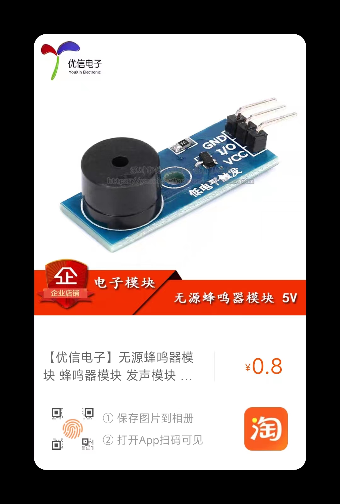

# Xiaoqian-Xu
Design of intelligent classroom fire monitoring system based on Internet of Things

## 目录

1. 仓库介绍 Introduction
2. 硬件选型 Hardware Selection
3. 软件设计 Software Design
4. 系统框架 System Framework
5. PCB设计 PCB

## Introduction

采用`stm32`为主控，通过人体热释电感应传感器检测教室是否有人，通过火焰传感器检测是否存在火源、通过烟雾传感器检测是否存在烟雾，通过温度传感器检测当前教室温度，实时将数据通过LORA模块上传到监控系统，当出现火灾时，控制蜂鸣器报警并打开水泵，同时通知监控系统报警。操作人员可通过管理系统远程设置报警阈值，显示传感器信息等。

## Hardware Selection

控制器：采用STM32F103C8T6芯片作为[处理器](https://item.taobao.com/item.htm?spm=a1z0d.6639537/tb.0.0.6b207484eovS3n&id=679227834271)

传感器：

- [人体热释电感应传感器 HC-SR501](https://item.taobao.com/item.htm?spm=a1z0d.6639537/tb.0.0.566f7484UEqrqN&id=560524808864)
- [火焰传感器](https://item.taobao.com/item.htm?spm=a1z0d.6639537/tb.0.0.566f7484UEqrqN&id=655245008389) 
- [烟雾传感器 ZP13](https://item.taobao.com/item.htm?spm=a1z0d.6639537/tb.0.0.566f7484UEqrqN&id=600251530977)
- [温度传感器 DS18B20](https://item.taobao.com/item.htm?spm=a1z10.3-c-s.0.0.7c2d6a4bjIXnxQ&id=530481104083)

执行器：[蜂鸣器](https://item.taobao.com/item.htm?spm=4077u.7625083.0.0.5c5f4e69UcFXRZ&id=522555899513) ，[继电器](https://item.taobao.com/item.htm?spm=a1z0d.6639537/tb.0.0.6b207484eovS3n&id=549692985984)

通信装置：[LORA](https://item.taobao.com/item.htm?spm=a1z0d.6639537/tb.0.0.6b207484eovS3n&id=634789093512),  [USB转TTL](https://item.taobao.com/item.htm?spm=a1z0d.6639537/tb.0.0.6b207484eovS3n&id=522571378803)

<table>
  <tr>
  <td></td>
  <td></td>
  <td></td>
  </tr>
  <tr>
  <td></td>
  <td></td>
  <td></td>
  </tr>
  <tr>
  <td></td>
  <td></td>
  <td></td>
  </tr>
</table>

**材料清单**

| 序号 | 名称                 | 功能说明     | 价格(￥) | 数量 |
| ---- | -------------------- | ------------ | -------- | ---- |
| 1    | STM32F103C8T6核心板  | 主控         | 17.5     | 1    |
| 2    | 人体热释电感应传感器 | 感应是否有人 | 4.4      | 1    |
| 3    | 火焰传感器           | 检测火焰     | 11       | 1    |
| 4    | 烟雾传感器           | 检测烟雾     | 12       | 1    |
| 5    | 温度传感器           | 检测温度     | 3.6      | 1    |
| 6    | 蜂鸣器               | 报警装置     | 0.8      | 1    |
| 7    | LORA模块             | 通信装置     | 38       | 2    |
| 8    | 继电器               | 模拟水泵装置 | 3.5      | 1    |
| 9    | USB转TTL             | 通信装置     | 4.5      | 1    |

## Software Design

通过QT设计上位机界面，对教室火灾检测系统进行远程监控和管理

## System Framework

## PCB

**原理图**

**PCB**

