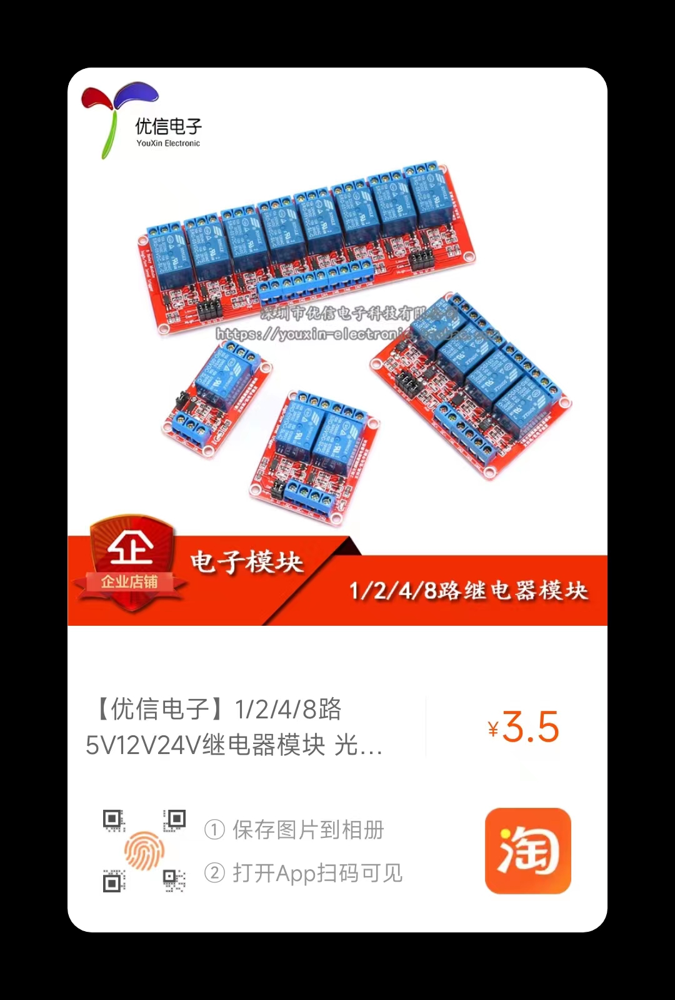

# Xiaoqian-Xu
Design of intelligent classroom fire monitoring system based on Internet of Things

## 目录

1. 仓库介绍 Introduction
2. 硬件选型 Hardware Selection
3. 软件设计 Software Design
4. 系统框架 System Framework
5. PCB设计 PCB

## Introduction

采用`stm32`为主控，通过人体热释电感应传感器检测教室是否有人，通过火焰传感器检测是否存在火源、通过烟雾传感器检测是否存在烟雾，通过温度传感器检测当前教室温度，实时将数据通过LORA模块上传到监控系统，当出现火灾时，控制蜂鸣器报警并打开水泵，同时通知监控系统报警。操作人员可通过管理系统远程设置报警阈值，显示传感器信息等。

## Hardware Selection

控制器：采用STM32F103C8T6芯片作为[处理器](https://item.taobao.com/item.htm?spm=a1z0d.6639537/tb.0.0.6b207484eovS3n&id=679227834271)

传感器：

- [人体热释电感应传感器 HC-SR501](https://item.taobao.com/item.htm?spm=a1z0d.6639537/tb.0.0.566f7484UEqrqN&id=560524808864)
- [火焰传感器](https://item.taobao.com/item.htm?spm=a1z0d.6639537/tb.0.0.566f7484UEqrqN&id=655245008389) 
- [烟雾传感器 ZP13](https://item.taobao.com/item.htm?spm=a1z0d.6639537/tb.0.0.566f7484UEqrqN&id=600251530977)
- [温度传感器 DS18B20](https://item.taobao.com/item.htm?spm=a1z10.3-c-s.0.0.7c2d6a4bjIXnxQ&id=530481104083)

执行器：[蜂鸣器](https://item.taobao.com/item.htm?spm=4077u.7625083.0.0.5c5f4e69UcFXRZ&id=522555899513) ，[继电器](https://item.taobao.com/item.htm?spm=a1z0d.6639537/tb.0.0.6b207484eovS3n&id=549692985984)

通信装置：[LORA](https://item.taobao.com/item.htm?spm=a1z0d.6639537/tb.0.0.6b207484eovS3n&id=634789093512),  [USB转TTL](https://item.taobao.com/item.htm?spm=a1z0d.6639537/tb.0.0.6b207484eovS3n&id=522571378803)

<table>
  <tr>
  <td></td>
  <td></td>
  <td></td>
  </tr>
  <tr>
  <td></td>
  <td></td>
  <td></td>
  </tr>
  <tr>
  <td></td>
  <td></td>
  <td></td>
  </tr>
</table>

**材料清单**

| 序号 | 名称                 | 功能说明     | 价格(￥) | 数量 |
| ---- | -------------------- | ------------ | -------- | ---- |
| 1    | STM32F103C8T6核心板  | 主控         | 17.5     | 1    |
| 2    | 人体热释电感应传感器 | 感应是否有人 | 4.4      | 1    |
| 3    | 火焰传感器           | 检测火焰     | 11       | 1    |
| 4    | 烟雾传感器           | 检测烟雾     | 12       | 1    |
| 5    | 温度传感器           | 检测温度     | 3.6      | 1    |
| 6    | 蜂鸣器               | 报警装置     | 0.8      | 1    |
| 7    | LORA模块             | 通信装置     | 38       | 2    |
| 8    | 继电器               | 模拟水泵装置 | 3.5      | 1    |
| 9    | USB转TTL             | 通信装置     | 4.5      | 1    |

### 模块使用说明

#### DS18B20

- 工作电压：3V～5.5V
- 测温范围：-55°C～+125°C(-67°F～+257°F)误差±2°C，-10°C～+85°C误差±0.5°C
- 引脚需要配置为输入或者输出模式

#### HC-SR501

- 全自动感应（当有**人进人其感应范围则输出高电平**，人离开感应范围则自动**延时关闭**高电平输出低电平）；

- ~~预留有光敏控制位置，可添加光敏电阻，白天或光线强时不感应（5539光敏电阻配合使用）；~~

- 两种触发方式（L不可重复、H可重复，可跳线选择，默认为H）；

  > 不可重复触发方式：即感应输出高电平后，延时时间一结束，输出将自动从
  > 高电平变为低电平；
  > 可重复触发方式：即如果有人休在其感应范围内活动，其输出将一直保持高
  > 电平。

- 具有感应封锁时间（默认3一4秒）；

  > 感应模块在每一次感应输出后（高电平变为低电平），
  > 可以紧跟着设置一个封锁时间，在此时间段内感应器
  > 不接收任何感应信号。此功能可以实现（感应输出时间
  > 和封锁时间）两者的间隔工作，可应用于间隔探测产品
  > 同时此功能可有效抑制负载切换过程中产生的各种干扰

- 工作电压范围（默认**DC5V**)；
- 模块通电后有**一分钟左右的初始化时间**，在此时间模块会间隔地输出0一3次，一分钟后进人待机状态

#### Flame Sensor

- DC5V
- 开关量输出

#### ZP13

- DC5V
- 开关量输出 1 报警 0 未报警

#### Lora

- DC 3.3-5.0V
- 模块1（主节点）地址：1；信道：20
- 模块2（子节点）地址：2；信道：20

## Software Design

通过QT设计上位机界面，对教室火灾检测系统进行远程监控和管理

## System Framework

## PCB

**原理图**

**PCB**

## 节点配置

### 通信协议

1. 串口通信参数 (**115200,8,1,N**)

   波特率（baud rate）： 115200bps
   数据位（data bits）： 8bits
   校验位（parity bit）： Not used
   结束位（stop bits）： 1bit  

2. 数据帧定义 

   **单片机->上位机(12Bytes)**

   | 字节序号 | 说明         | 可选值             |
   | -------- | ------------ | ------------------ |
   | byte0    | 帧头         | 0x3A               |
   | byte1    | 通信地址     |                    |
   | byte2    | 通信通道     |                    |
   | byte3    | 温度值小数位 |                    |
   | byte4    | 温度值整数位 |                    |
   | byte5    | 烟雾状态     | 0x01：开；0x00：闭 |
   | byte6    | 火焰状态     | 0x01：开；0x00：闭 |
   | byte7    | 人员状态     | 0x01：开；0x00：闭 |
   | byte8    | 报警状态     | 0x01：开；0x00：闭 |
   | byte9    | 保留位       |                    |
   | byte10   | 帧尾         | 0x0D               |
   | byte11   | 帧尾         | 0x0A               |

   **上位机->单片机（12Bytes）**

   | 字节序号 | 说明                 | 可选值             |
   | -------- | -------------------- | ------------------ |
   | byte0    | 帧头                 | 0x3A               |
   | byte1    | 通信地址             |                    |
   | byte2    | 通信通道             |                    |
   | byte3    | 温度值报警阈值小数位 |                    |
   | byte4    | 温度值报警阈值整数位 |                    |
   | byte5    | 报警开关状态         | 0x01：开；0x00：闭 |
   | byte6    | 水阀开关状态         | 0x01：开；0x00：闭 |
   | byte7    | 保留位               |                    |
   | byte8    | 保留位               |                    |
   | byte9    | 保留位               |                    |
   | byte10   | 帧尾                 | 0x0D               |
   | byte11   | 帧尾                 | 0x0A               |

   
